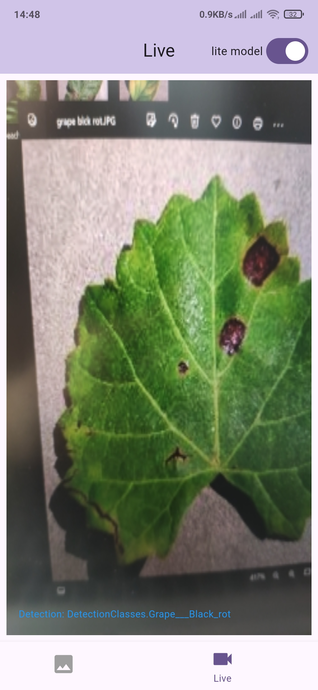
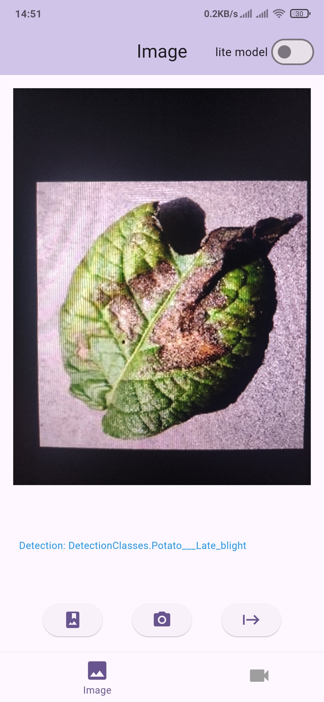

# Crop Disease Detection (Edge AI Platform)

An advanced, production-grade mobile application designed for real-time plant disease classification using embedded Deep Learning models. This project bridges the gap between high-level computer vision and severe mobile hardware resource constraints, enabling local on-device inference without relying on cloud computation.

  

---

## 📌 Core Engineering Highlights & Innovations

*   **On-Device Embedded Inference:** Zero cloud dependency, guaranteeing absolute offline operability in remote agricultural fields and sub-millisecond execution latency.
*   **Dual-Model Execution Strategy:** Architecture designed to support both high-accuracy analysis and resource-constrained edge tracking.
*   **Real-Time Live Frame Stream Processing:** Low-level integration with the device camera to intercept image buffers and route them into the tensor input channels smoothly.
*   **Quantization & Hardware Acceleration:** Applied Post-Training Quantization (PTQ) to shrink weights while maintaining critical inference precision.

---

## 🧠 Deep Learning Architecture & Optimization Matrix

The core contribution of this system lies in balancing classification accuracy with the physical memory and thermal constraints of mobile CPU/GPU hardware:

| Model Variant | Base Architecture | Classes | Precision / Acc. | Purpose / Deployment Target |
| :--- | :--- | :---: | :---: | :--- |
| **Lite Model (Optimized)** | `EfficientNet_Lite` (Quantized) | 23 | **96.0%** | Highly efficient, real-time local inference for low-tier hardware |
| **Normal Model (Heavy)** | `EfficientNetB3` (Full-Precision) | 23 | **99.7%** | Maximum precision profiling inside optimal device environments |

---

## ⚙️ Architectural Core & Scanning Modes

The application logic decouples camera streaming loops from the tensor inference cycle, utilizing distinct operating states:

### 1. Live Pipeline Mode
Intercepts live camera image buffers (`YUV_420_888` / `BGRA_8888`), applies real-time aspect-ratio normalization and matrix rotations, and updates inference bounding boxes asynchronously to achieve a smooth frame rate.

  

### 2. Static Image Analysis Mode
Allows users to input high-resolution gallery pictures. It processes the raw file stream, resizes tensors to meet target model dimensions ($224 \times 224$ or $300 \times 300$), and executes a high-fidelity inference passes.

  

---

## 🛠️ Built With & Deep Tech Stack

The software implementation leverages structural frameworks optimized for edge telemetry:

*   **Cross-Platform Architecture:** [Flutter](https://flutter.dev) & [Dart](https://dart.dev) for highly performant, rendering-isolated client views.
*   **Inference Kernel Engine:** [TensorFlow Lite (TFLite)](https://www.tensorflow.org/lite) for embedded execution of quantized neural network binaries.
*   **Image Processing Interceptors:** Low-level platform channels configured to pass camera streams directly into native image manipulation routines.

---

## 📄 Academic & Portfolio Notice

*This repository represents the architectural and mobile systems deployment phase of my Bachelor of Science Thesis. The localized dataset pipelines, raw unquantized Python model compilation weights, and private academic documentation matrices are reserved for evaluation and portfolio demonstration purposes.*
